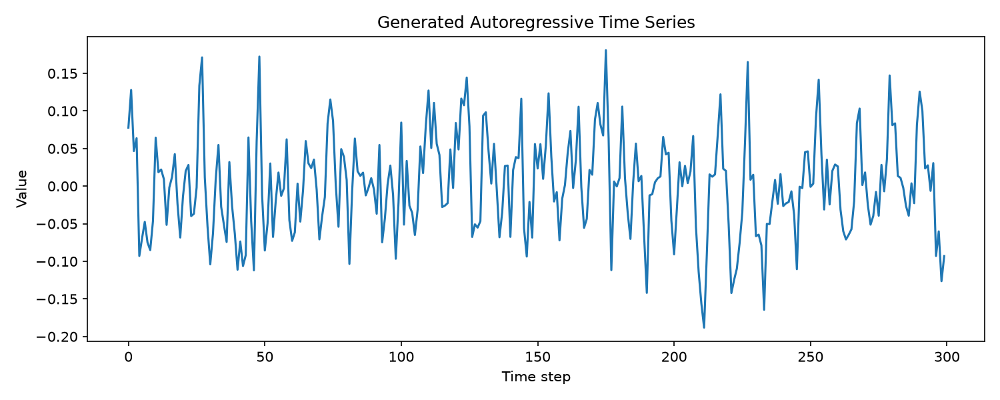
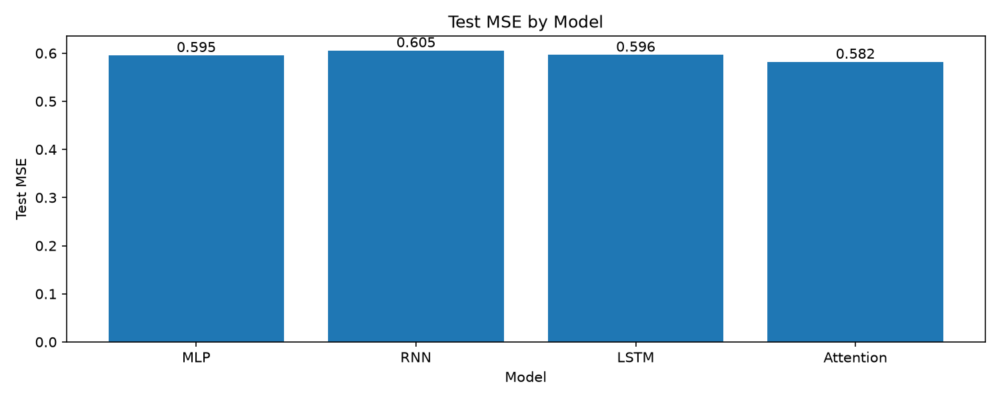
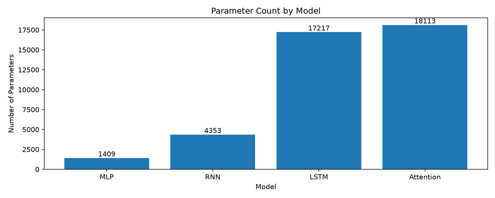

# Autoregressive Model Comparison

## Overview
This project compares four different autoregressive models: MLP, RNN, LSTM, and Attention.

The comparison focuses on both perdictive performance and model size, using test MSE and parameter count. This makes it possible to compare accuracy without ignoring the computational cost of each architecture.

## Task

We generate a synthetic autoregressive time series using the following formula
$$x_t = 0.45x_{t-1} - 0.10x_{t-2} + 0.40x_{t-10} + \epsilon$$

Where $\epsilon$ is small random noise term.

The models receives the previous 20 values of that series, and try to predict the next value.


## Models
- MLP: the 20 values are flattened into one vector. The vector goes under linear transformation and activation. Then produce single valued output.

- RNN: a hidden state is recurrently used and combined with the input value of the specific timestep, learns the sequential relationship.

- LSTM: based on RNN, gated memory and cell state are introduced to help long-term memory stay consistent.

- Attention: a manual multi-head self-attention model is implemented with learned positional embeddings. Each timestep can directly attend to earlier timesteps that the model learns to be useful.

## Experimental Setup

To form a fair comparison, all models are trained using the same setup.

- Input window: 20 timesteps
- Prediction target: next value only
- Train / validation / test split: 70% / 15% / 15%
- Batch size: 32
- Loss function: `nn.MSELoss()`
- Optimzer: `torch.optim.Adam()`
- Learning rate: 0.001
- Training epochs: 30
- Random seed: 42
- Model selection: the epoch with the lowest validation loss

For train/validation/test split, input windows are created after splitting the whole series with the previously mentioned ratio. This way, data leakage due to overlapping data is prevented.


## Results

| Model | Parameters | Best Epoch | Best Validation MSE | Test MSE |
|---|---:|---:|---:|---:|
| MLP | 1,409 | 2 | 0.6343 | 0.5954 |
| RNN | 4,353 | 12 | 0.6378 | 0.6054 |
| LSTM | 17,217 | 26 | 0.6326 | 0.5963 |
| Attention | 18,113 | 24 | 0.6214 | 0.5817 |

### Test Performance



### Model Size



## Key Findings
1. Attention achieved the lowest test MSE among all 4 models, however it has the most parameters.
2. RNN did not outperform the simplest MLP in this given task.
3. LSTM did achieve a lower test MSE compared to plain RNN, but required substantially more parameters.
4. Overall, model complexity increased much faster compared to predictive performance. A tradeoff between accuracy and parameter efficiency is observed in this experiment.


## How to Run
### 1. Clone the repository
```bash
git clone <https://github.com/randlandz/autoregressive-model-comparison.git>
cd autoregressive-model-comparison
```

### 2. Create a virtual environment
```bash
python -m venv .venv
```
Actitave it on macOS/Linux:
```bash
source .venv/bin/activate
```
or on Windows:
```powershell
.venv\Scripts\activate
```


### 3. Install dependencies 
```bash
python -m pip install -r requirements.txt
```
For GPU acceleration, install a PyTorch build appropriate for your system and GPU.

### 4. Inspect the generated dataset
```bash
python -m scripts.inspect_data
```

### 5. Train the models
```bash
python -m scripts.train_mlp
python -m scripts.train_rnn
python -m scripts.train_lstm
python -m scripts.train_attention
```
Training scripts will save the loss and prediction figures under `results/figures/`

### 6. Generate comparison figures
```bash
python -m scripts.compare_models
```